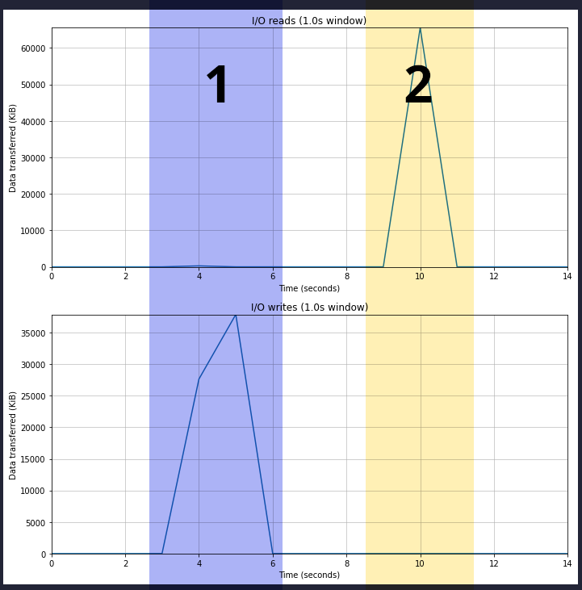
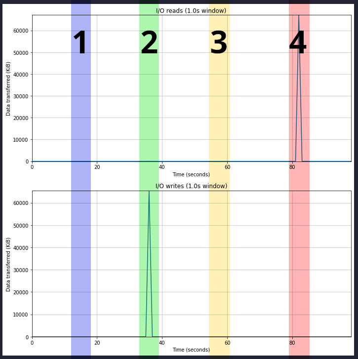

# go-example-io

## ℹ️ About

This repository contains a single short Go program that performs sequential reads and writes to a file over a short amount of time. It is used to test [rAdvisor](https://github.com/elba-docker/radvisor)'s block I/O instrumentation capabilities. The program has three "modes" (selected using the `--mode` parameter):

- `"write"` - this writes 64 MiB of cryptographically random bytes to a file at `--path [path]` 32 KiB at a time, sleeping 1 millisecond in between each write.
- `"read"` - this reads an entire file at `--path [path]` 32 KiB at a time, sleeping 1 millisecond in between each read. At the end, it computes the SHA-256 hash of the file and prints it out.

## 📃 Usage 

```
go-example-io --mode [mode] --path [path]
  --block-size int
        The size of each block to read/write (default 32768)
  --blocks int
        Number of blocks to read/write (default 2048)
  --iter-sleep duration
        Amount of time to sleep between read/write iterations (a single block read/written) (default 1ms)
  --mode string
        Mode (read, write) to use when running
  --path string
        Path of the file to read/write from
  --sync
        Whether to sync at the end of a write operation
```

## 🧪 Tests
### Commands for setting up test environment:

```sh
# In one terminal:
# See docker stat's view
# (should be the same as viewing cgroup (both 1 and 2) stats)
docker stats

# In another terminal:
# Build & run test container
docker build -t go-example-io .
docker run \
    -it \
    --rm \
    --name io-test-container \
    --mount target=/opt/mnt \
    --entrypoint sh \
    go-example-io:latest
```

### Commands for reliably testing (direct) I/O in cgroups v1 using `dd`:

```sh
# In another terminal:
# Run `watch ... cat` to show the contents of the `blkio.throttle.io_service_bytes_recursive` file in the container's cgroup.
# This is updated every 0.1s, so it should be a close approximation of what rAdvisor does.
# Note: this is using "cgroupfs" as the cgroup driver;
# the path to the cgroup is different if using "systemd" as the cgroup driver.
container_id=`docker ps -aqf "name=io-test-container" --no-trunc` \
    && sudo watch -e -n 0.1 \
       cat /sys/fs/cgroup/blkio/docker/$container_id/blkio.throttle.io_service_bytes_recursive

# In the container:
# 1. Test block I/O write bytes: this should add about 67108864 bytes (64 MiB)
#    to the block I/O write bytes statistic
dd if=/dev/zero of=/tmp/test.img bs=1M count=64 oflag=dsync
# 2. Test block I/O read bytes: this should add about 67108864 bytes (64 MiB)
#    to the block I/O read bytes statistic
dd if=/tmp/test.img of=/dev/null iflag=direct bs=1M
```

#### Results

The below graphs show the output of running rAdvisor at the same time (which is done using `sudo radvisor run docker -i 50ms`) when performing this test. Each colored section is labelled with a number corresponding to the number next to both of the commands that are run in the container. The top chart shows point-in-time KiB read each second, while the bottom chart shows the same but for writes.



### The problem with cgroups v1: buffered I/O

The diff in [this commit](https://git.kernel.org/pub/scm/linux/kernel/git/torvalds/linux.git/commit/?h=v4.14-rc4&id=3e1534cf4a2a8278e811e7c84a79da1a02347b8b) explains the limitations of cgroups v1 (what it calls "traditional cgroup hierarchies"):

> Page cache is dirtied through buffered writes and shared mmaps and
> written asynchronously to the backing filesystem by the writeback
> mechanism.  Writeback sits between the memory and IO domains and
> regulates the proportion of dirty memory by balancing dirtying and
> write IOs.
> 
> On traditional cgroup hierarchies, relationships between different
> controllers cannot be established making it impossible for writeback
> to operate accounting for cgroup resource restrictions and all
> writeback IOs are attributed to the root cgroup.
> 
> If both the blkio and memory controllers are used on the v2 hierarchy
> and the filesystem supports cgroup writeback, writeback operations
> correctly follow the resource restrictions imposed by both memory and
> blkio controllers.

Essentially, it says that buffered block writes (which as far as I understand it is most normal writes, since they write to the page cache before being synced to disk) cannot be reliably kept track of in cgroups v1. It specifically focuses on resource restrictions, **but these problems also apply to resource accounting** (which is what rAdvisor relies on). As a result, cgroups v1 is not suitable to reliably keep track of container resource utilization when it comes to block I/O unless you assume that all I/O is direct (and not buffered). The below test shows these limitations in action.

This blog post goes a bit more in detail about this problem & its implications for resource accounting: https://andrestc.com/post/cgroups-io/.

### Commands for testing (buffered) I/O in cgroups v1 using `go-example-io`

```sh
# In the container:
# 1. Run go-example-io to create a test file: (1 MiB blocks, 64 of them)
go-example-io --mode write --path /opt/mnt/file --block-size 1048576 --blocks 64
# 2. Run go-example-io to create a test file: (1 MiB blocks, 64 of them),
#    and sync the file to disk at the end of the operation.
go-example-io --mode write --path /opt/mnt/file2 --block-size 1048576 --blocks 64 --sync
# 3. Run go-example-io to read the first test file and output its SHA-256 digest:
#    (this probably won't output any statistics due to the page cache already containing this file)
go-example-io --mode read --path /opt/mnt/file --block-size 1048576

# On the host machine:
# Drop all pages in the page cache:
sudo sh -c "echo 1 > /proc/sys/vm/drop_caches"

# In the container:
# 4. Run go-example-io to read the first test file and output its SHA-256 digest:
go-example-io --mode read --path /opt/mnt/file --block-size 1048576
```

#### Results

The below graphs show the output of running rAdvisor at the same time (which is done using `sudo radvisor run docker -i 50ms`) when performing this test. Each colored section is labelled with a number corresponding to the number next to each of the above 4 commands that are run in the container (excluding the command run on the host machine to drop the page cache). The top chart shows point-in-time KiB read each second, while the bottom chart shows the same but for writes.



The graphs show the effects of buffered I/O on the resource utilization statistics:
1. The first write ends up entirely in the system's page cache, and is flushed to disk at some indeterminate future time. Because this happens as a result of the writeback mechanism, it is not accounted for in the cgroup v1 block I/O utilization, and is missing from this chart entirely.
2. The second write also ends up entirely in the system's page cache, but because `file.Sync()` is called at the end of the process's runtime, the entire file gets flushed to disk. I suspect this bypasses the writeback mechanism and instead directly queues the dirty pages to be written to disk. As a result, it shows up in the I/O writes graph.
3. The first read reads entirely from the system's page cache, and as a result doesn't actually perform any disk I/O. As a result, it shows no resource utilization on the graph.
4. The second read was done **after** dropping the host system's page cache, so it has to actually pull the file in from disk to read it. As a result, it shows up in the I/O reads graph.

### Cgroups v2

I included this info for completeness, but because rAdvisor is not currently equipped to read statistics from cgroups v2 files, I couldn't run rAdvisor at the same time as these tests. Still, as far as I understand, they would show that cgroups v2 overcomes some of the limitations of cgroups v1. For example, I suspect that if the above experiment using the four `go-example-io` commands was performed on a system with cgroups v2, then one would see that the write in 1 would show up on the graph and be properly accounted for (in this case, I would expect it to show up whenever writeback is triggered, which should be between 3 and 4 when I manually dropped the host system's page cache).

The `dd` commands, however, should show identical effects (since they use direct I/O).

#### Enabling cgroups v2 (on Ubuntu <21.10, Docker >=20.10)

See https://rootlesscontaine.rs/getting-started/common/cgroup2/ to see if cgroups v2 are already enabled, and if not, how to enable them by editing the GRUB settings (make sure you run `sudo update-grub` afterwards). Then, reboot and then the system should be set up to use cgroups v2.

#### Commands for reliably testing I/O in cgroups v2:

```sh
# In another terminal:
# Run `watch ... cat` to show the contents of the `io.stat` file in the container's cgroup.
# This is updated every 0.1s, so it should be a close approximation of what rAdvisor does.
container_id=`docker ps -aqf "name=io-test-container" --no-trunc` \
    && sudo watch -e -n 0.1 \
       cat /sys/fs/cgroup/system.slice/docker-$container_id.scope/io.stat

# In the container:
# Test block I/O write bytes: this should add about 67108864 bytes (64 MiB)
# to the block I/O write bytes statistic
dd if=/dev/zero of=/tmp/test.img bs=1M count=64 oflag=dsync
# Test block I/O read bytes: this should add about 67108864 bytes (64 MiB)
# to the block I/O read bytes statistic
dd if=/tmp/test.img of=/dev/null iflag=direct bs=1M
```
